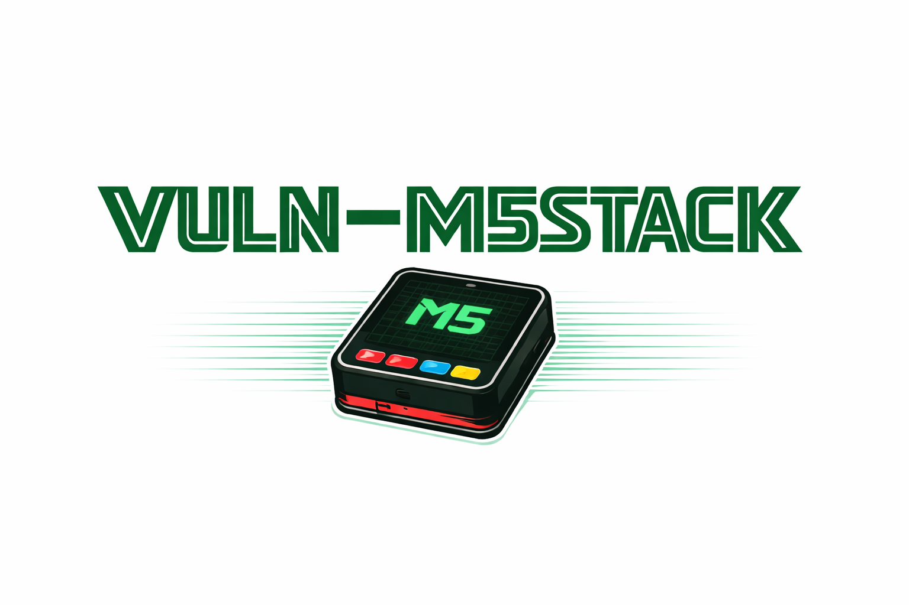

<p align="center">
  
</p>

# CoreS3 Camera Training Platform

> **IMPORTANT (2026-04-06): Boot crash fix -- please re-pull.** A bug caused the device to crash on boot with a `Guru Meditation Error: Core 1 panic'ed (LoadProhibited)` due to floating SPI/I2C GPIO pins triggering spurious DMA transactions that corrupted system memory. This has been fixed. If you are experiencing boot crashes or UART issues, pull the latest code and re-flash your device.

IoT Security Education Device for M5Stack CoreS3 (ESP32-S3)

> **Disclaimer:** This firmware is *intentionally* vulnerable. That is the whole point. If you plug it into your production network, put it on the open internet, or leave it running at your in-laws' house - whatever happens next is entirely on you. We are not responsible for your device getting owned, your network getting popped, your credentials getting leaked, your dog learning to deauth your router, or any other creative misuse of a device that was literally designed to be hacked. Use it on an isolated lab network, treat it like the live grenade it is, and have fun breaking things responsibly. Happy hacking.

> **This project is new and under active development.** If you run into a lab that seems broken, instructions that don't match the device behavior, or documentation that's wrong or incomplete - please open an issue. We want every lab to be completable from start to finish, and your feedback helps make that happen.

> **Note on scope:** These labs focus on beginner-to-intermediate IoT security techniques using affordable, accessible hardware. Advanced topics like voltage glitching and power analysis (SCA) are not included in this release, but may be added in a future lab pack.

> **Free to use, forever.** Individual, classroom, corporate training, bootcamp, conference workshop - use this however you want. If your company wants to run this as internal security training, go for it. No permission needed, no licensing fees, no strings attached. All we ask is that you stay in touch - tell us how it went, what worked, what didn't, and how many people you got hooked on hardware hacking. Open an issue, email us at contact@gromhacks.com, or just star the repo so we know the garden is growing.

## Overview

This is a cybersecurity training platform built on the M5Stack CoreS3 that teaches IoT security through hands-on exploitation of realistic vulnerabilities. Students discover and exploit real device flaws rather than synthetic challenges.

### Key Features

- **32 Realistic Security Labs** covering web, firmware, wireless, hardware, crypto, and forensics
- **CTF Mode** for experienced pentesters who want to find all 32 bugs without walkthroughs
- **Real IoT Camera Firmware**: Camera streaming, Wi-Fi AP, BLE, OTA updates, touchscreen UI
- **No Synthetic Flags**: Students prove exploitation through real device state changes (credential dumps, admin bypass, code execution)

## Hardware Requirements

**Why the CoreS3 specifically?** This project requires the [M5Stack CoreS3 ESP32-S3](https://shop.m5stack.com/products/m5stack-cores3-esp32s3-iotdevelopment-kit) - not a generic ESP32 dev board. The labs depend on its specific combination of peripherals: built-in camera (GC0308), capacitive touchscreen, I2C PMIC and GPIO expander, I2S speaker and microphone, BLE, Grove I2C/SPI/UART ports, microSD slot, and USB-C with native USB. No other single board has all of these in one package, and the labs are written against this exact hardware layout.

> **Not affiliated.** This project has no affiliation with M5Stack. We receive no sponsorship, commission, or compensation of any kind. We built this because the existing options are absurd - commercial IoT hacking training kits cost $300+ for closed-source, single-purpose boards you can't repurpose or learn from once the labs are done. That's gatekeeping, not education. The CoreS3 costs about $50, runs open-source firmware you can read and modify, and is a fully capable dev board you can reuse for real projects after you're done hacking it. Plenty of CTFs and vulnerable VMs exist for web and network security, but almost nothing for hands-on hardware hacking with real embedded devices. So we made one. This is a community project, built and maintained for free, because we think this stuff matters.

You will need the CoreS3 board plus a handful of affordable tools. Any equivalent hardware works - these are just examples of what you will need/want to have.

**Required:**

| Item | Purpose |
|------|---------|
| [M5Stack CoreS3 ESP32-S3](https://shop.m5stack.com/products/m5stack-cores3-esp32s3-iotdevelopment-kit) | Target device (ESP32-S3, camera, WiFi, BLE, touchscreen) |
| USB-C data cable | Programming, power, serial console |
| Raspberry Pi Pico or Pico 2 | I2C/SPI bus attack tool |
| USB WiFi adapter (monitor mode) | WiFi attacks while staying connected to internet |
| Logic analyzer (8-ch, 24MHz+) | I2C/SPI/UART bus sniffing |
| MicroSD card (16GB) + card reader | SD card bootloader bypass, forensics |
| Dupont jumper wires (M-M, M-F, F-F) | Connecting Pico to CoreS3 Grove ports |
| Digital multimeter (auto-ranging) | Continuity checks, voltage verification |
| Soldering iron + solder (optional) | For soldering header pins if your Pico comes without them |

**Not required:** No expensive tools like J-Link debuggers, oscilloscopes, Bus Pirates, or ChipWhisperers.

### Example Shopping List

These are budget-friendly examples - use whatever you have or prefer:

- **M5Stack CoreS3** (~$50) - The target device: https://shop.m5stack.com/products/m5stack-cores3-esp32s3-iotdevelopment-kit
- **Logic analyzer** (~$10) - USB Logic Analyzer, 8 CH 24MHz (FX2-based, works with sigrok/PulseView): https://a.co/d/0fW1Hutd
- **Raspberry Pi Pico** (~$7) - Official RP2040 board with headers: https://a.co/d/05RSPcKR
- **Raspberry Pi Pico 2** (~$7) - RP2350 (also works): https://a.co/d/0hWq2tjx
- **WiFi adapter** (~$15) - Monitor mode capable (Atheros AR9271 or RTL8812AU chipset): https://a.co/d/0hQgr0Wu
- **Dupont wires** (~$7) - Eiechip 120-pin jumper wire kit (M-M, M-F, F-F): https://a.co/d/0glzaPCu
- **Multimeter** (~$15) - AstroAI TRMS 6000 or equivalent: https://a.co/d/0hyTI6IS or https://a.co/d/09mKE6xm
- **Soldering iron** (~$15) - Any basic kit for header pins (or buy Picos with pre-soldered headers)
- **MicroSD card** (~$8) - Any 16GB+ FAT32-formatted card, plus a USB card reader

**Total: ~$130** for everything from scratch. If you already have a multimeter, soldering iron, or jumper wires, it's closer to $90.

### Datasheets & Schematics

Full datasheets for every chip on the CoreS3 and the board schematic are in `datasheets/`:

- `Sch_M5_CoreS3_v1.0.pdf` - Board schematic
- `esp32-s3_datasheet_en.pdf` - Main MCU
- `esp32-s3_technical_reference_manual_en.pdf` - Full TRM
- `GC0308.pdf` - Camera sensor
- `AXP2101_Datasheet_V1.0_en.pdf` - Power management IC
- `AW9523B-CN.pdf` - GPIO expander
- `AW88298.pdf` - Audio amplifier
- `BMI270.pdf` / `BMM150.pdf` - IMU sensors
- `BM8563.pdf` - RTC
- `LTR-553ALS-WA.pdf` - Ambient light sensor
- `ES7210.pdf` - Audio codec
- `SCH_DinBase_V1.1.pdf` - DIN base schematic

## Software Requirements

- PlatformIO Core 6.x (CLI) or VS Code with PlatformIO extension
- Python 3.8+
- sigrok/PulseView (for logic analyzer labs)
- aircrack-ng suite (for WiFi deauth lab)
- bleak Python library (for BLE labs)

## Quick Start

### Option A: Flash Pre-built Firmware (fastest)

Pre-built binaries are in the `firmware/` directory. No toolchain or build required.

```bash
# Install esptool (if not already installed)
pip install esptool

# Flash the device (auto-detects port)
./firmware/flash.sh

# Or specify port manually
./firmware/flash.sh /dev/ttyACM0
```

### Option B: Build from Source

```bash
# Install PlatformIO (if not already installed)
pip install platformio

# Build and flash firmware
pio run -e M5CoreS3 -t upload
```

### Monitor Serial Output

```bash
pio device monitor -b 115200
```

### Connect to Device

1. Device creates WiFi AP: `CoreS3-CAM-XXXX` (open, no password)
2. Connect your computer to the AP
3. Browse to http://192.168.4.1
4. Serial console available at `/dev/ttyACM0` (115200 baud)

## Lab Categories

Labs follow a logical IoT penetration testing methodology. See `docs/labs/LABS.md` for the full index with walkthroughs, or `docs/labs/CTF.md` for challenge mode.

| Phase | Labs | Focus |
|-------|------|-------|
| 0. Device Setup | L00 | Hardware identification, chip recon |
| 1. Reconnaissance | L01-L04 | UART, I2C, SPI sniffing, firmware extraction |
| 2. Firmware Analysis | L05-L07 | SD card bypass, binary patching, unsigned OTA |
| 3. Web/API Attacks | L08-L17 | Injection, traversal, JWT, overflow, CSRF, info leak |
| 4. Hardware Bus | L18-L20 | I2C/SPI/BLE buffer overflow via Pico |
| 5. Wireless | L21-L24 | BLE credential leak, rogue OTA, deauth, mDNS spoof |
| 6. USB | L25-L27 | DFU abuse, memory leak, auth race condition |
| 7. Cryptographic | L28-L30 | Weak RNG, key reuse, timing side-channel |
| 8. Forensics | L31 | SD card data recovery |

## Device Boot Flow

1. **Setup Mode** (first boot): Creates Wi-Fi AP `CoreS3-CAM-XXXX` (open)
2. **Web Configuration**: Configure WiFi at http://192.168.4.1
3. **PIN Lock Screen**: 6-digit PIN displayed on first boot
4. **Camera View**: Main operation mode
5. **Admin Mode**: Enter admin PIN for advanced features

## Firmware & Source Code

The full source code is in `src/`, `include/`, and `lib/`. You can read it directly, grep for patterns, or use it alongside decompiled output.

### Source Layout

```
src/
+-- main.cpp                  # Entry point, wires CameraDevice + CameraApp + SerialShell
+-- CameraApp.cpp/.h          # Touchscreen UI (LVGL): PIN entry, camera view, admin, self-test
+-- CameraDevice.cpp/.h       # Core singleton: init(), loop(), device lifecycle
+-- CameraDevice_Camera.cpp   # Camera hardware init, JPEG frame capture
+-- CameraDevice_Audio.cpp    # Speaker and microphone hardware
+-- CameraDevice_Auth.cpp     # JWT signing/verification, PIN check, NVS settings
+-- CameraDevice_Web.cpp      # HTTP server: all routes and request handlers
+-- CameraDevice_Admin.cpp    # Admin panel endpoints (status, NVS, reboot, self-test)
+-- CameraDevice_Bus.cpp      # I2C/SPI/BLE bus operations and peripheral handlers
+-- CameraDevice_Diag.cpp     # Diagnostic hooks via run_diagnostic() (debug builds)
+-- CameraDevice_Internal.h   # Shared declarations between CameraDevice modules
+-- SerialShell.cpp/.h        # UART command-line interface (user and admin commands)

include/
+-- config.h                  # Hardware pin definitions, I2C addresses, GPIO assignments
+-- DualSerial.h              # Dual-output serial (USB CDC + debug UART on GPIO43/44)
+-- lv_conf.h                 # LVGL display library configuration

lib/
+-- BMI270-Sensor-API/        # Accelerometer/gyroscope driver (Bosch)
+-- BMM150-Sensor-API/        # Magnetometer driver (Bosch)
+-- lv_anim_label/            # LVGL animated label widget
+-- lv_ext/                   # LVGL extension widgets
+-- lv_poly_line/             # LVGL polyline drawing widget
+-- m5gfx_lvgl/               # M5GFX display driver bridge for LVGL
+-- PageManager/              # UI page/screen navigation manager
+-- ResourceManager/          # Asset and resource management
+-- libesp32-camera.a         # Pre-compiled ESP32 camera driver
```

After building (`pio run -e M5CoreS3`), the compiled firmware is at:

- `.pio/build/M5CoreS3/firmware.bin` - Raw binary (flash with esptool, analyze with `strings`, `hexdump`, or extract from a live device)
- `.pio/build/M5CoreS3/firmware.elf` - ELF with debug symbols (load into Ghidra, use with `xtensa-esp32s3-elf-nm`, `objdump`, or GDB)

You can also extract firmware directly from a running device using `esptool.py read_flash` (see L04). The `docs/labs/L04-firmware-extraction/tools/bin2elf.py` script converts a raw `.bin` dump back to an ELF for disassembly. Ghidra with the Xtensa processor module works well for static analysis.

## Project Structure

```
vuln-m5stack/
+-- src/                          # Firmware source code
+-- include/                      # Header files
+-- docs/labs/                    # 32 lab walkthroughs + CTF.md
+-- docs/labs/L*/tools/           # Per-lab exploit scripts and helper tools
+-- datasheets/      # Chip datasheets and board schematic
+-- platformio.ini                # PlatformIO build configuration
+-- partitions_ffat.csv           # Flash partition table (16MB)
```

## Troubleshooting

- **Device not reachable**: Connect to AP `CoreS3-CAM-XXXX`, use http://192.168.4.1
- **Force AP mode**: Serial shell `nvs-clear` (requires admin login) then `reboot`
- **Serial port busy**: Close other monitors, check udev rules

## Safety

1. Use ONLY in isolated lab networks
2. Training builds are intentionally vulnerable
3. DO NOT deploy on production networks

## Dedication

This project is dedicated to **Tamara (MaraJade)** - the friend who sent me an electronic car and a box of other junk and said *"get to learning."* That changed everything.

Mara's love for hardware hacking was sparked by *Silent Running* - a 1972 film about a man alone on a spaceship, tending the last gardens from Earth with nothing but determination, ingenuity, and a few small robots he taught to care. She saw herself in that story: someone who believed that knowledge shouldn't be locked behind expensive tools and gatekept certifications, that the best way to learn how things work is to take them apart, and that the next generation deserves the same chance to get their hands dirty.

I built this project in that spirit. If even one person picks up a CoreS3, cracks open the firmware, and feels that same spark - then the garden grows.

*"Around the Sun, forever. And there is a robot gardener."*

## License

MIT License - See LICENSE file

## References

- [M5Stack CoreS3 Documentation](https://docs.m5stack.com/en/core/CoreS3)
- [ESP-IDF Programming Guide](https://docs.espressif.com/projects/esp-idf/)
- [M5Unified Library](https://github.com/m5stack/M5Unified)
